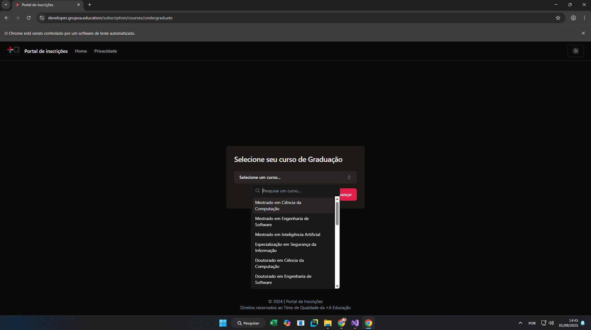
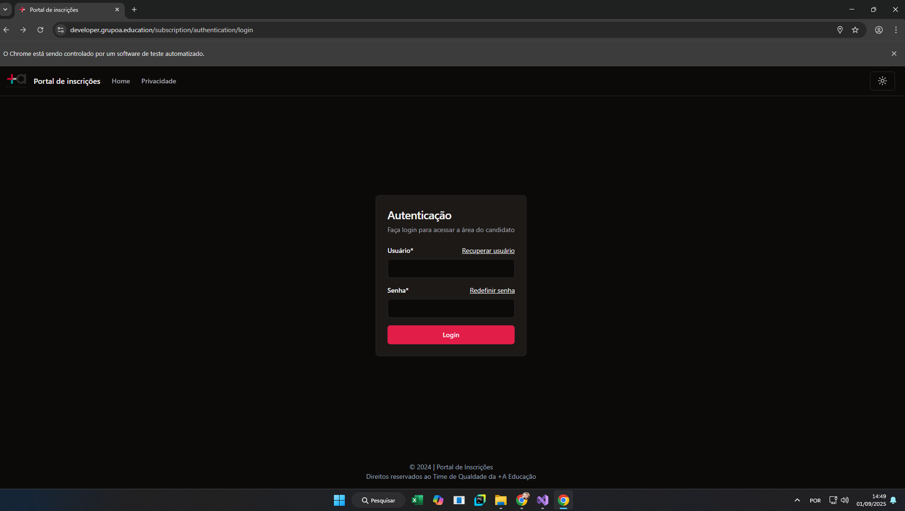
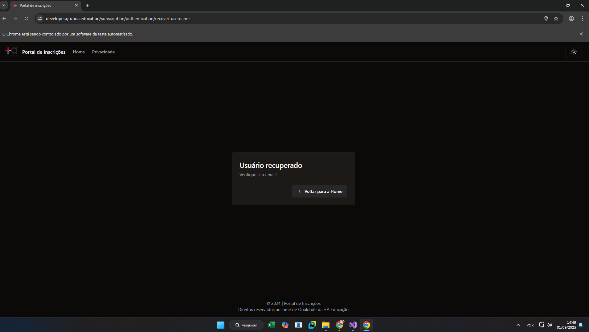
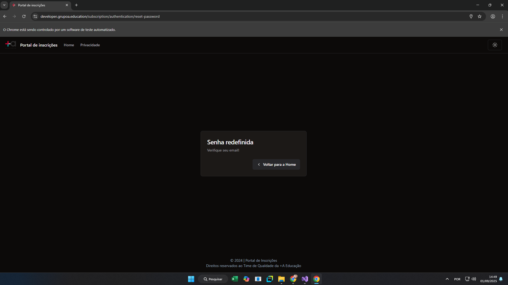
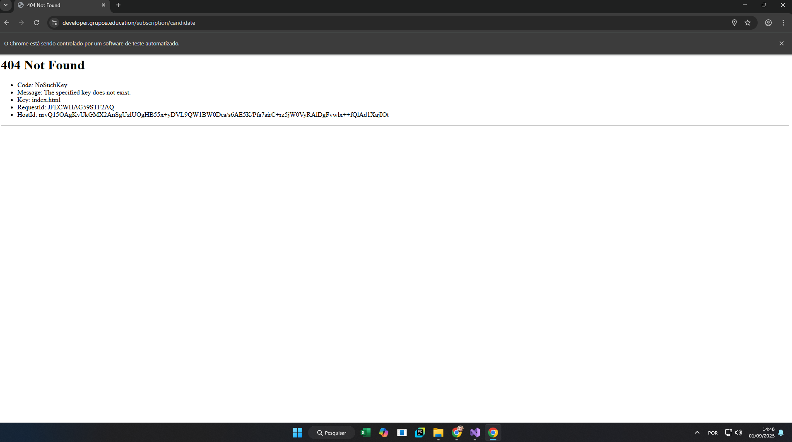
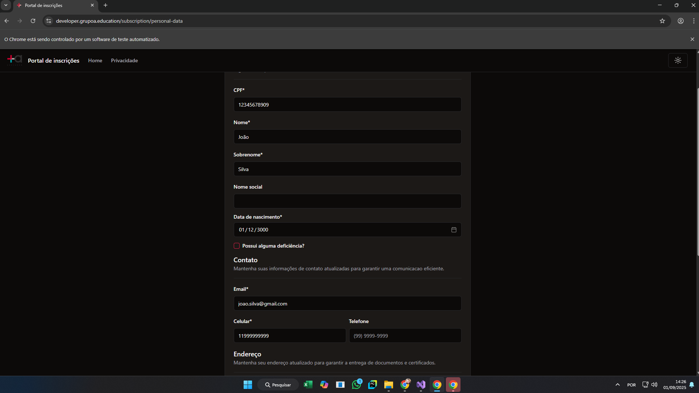
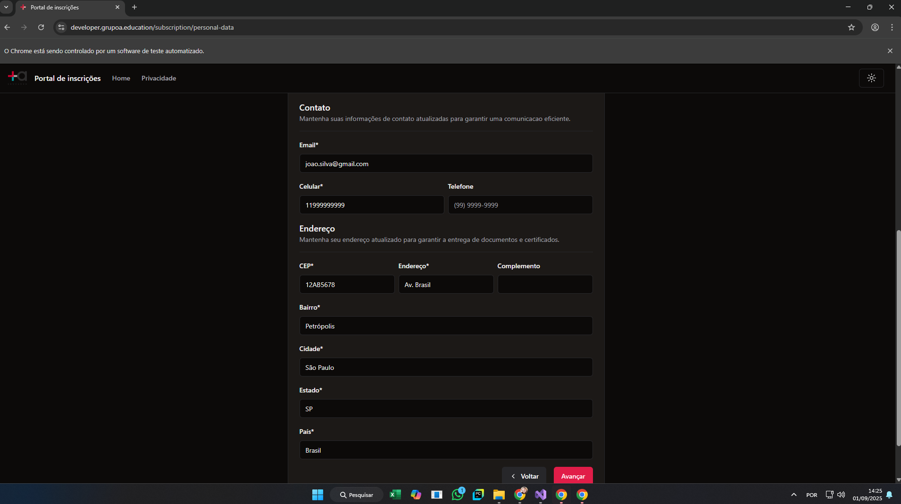
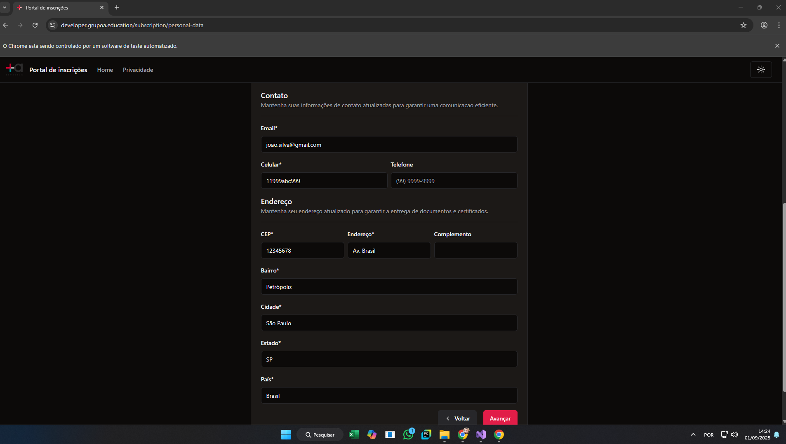
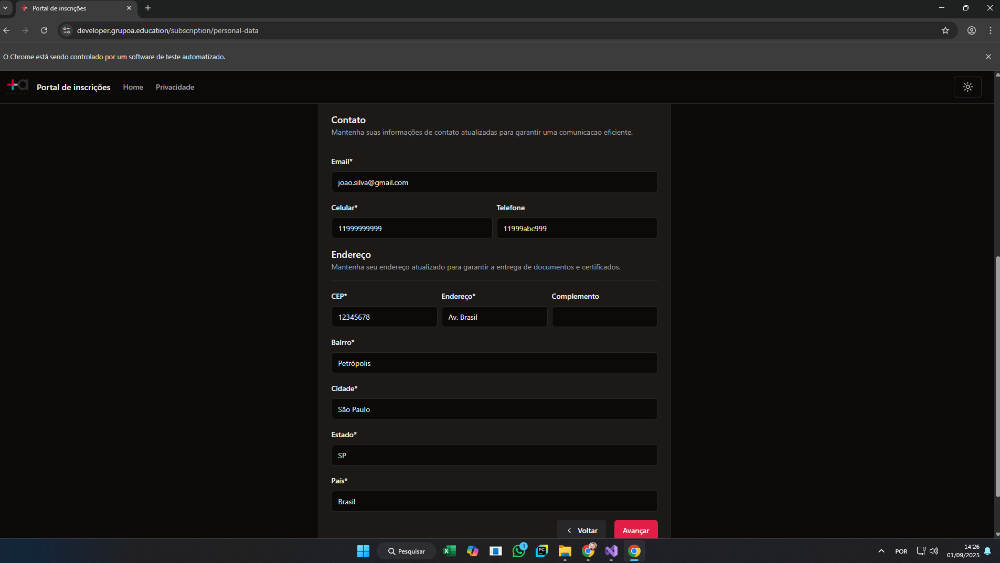
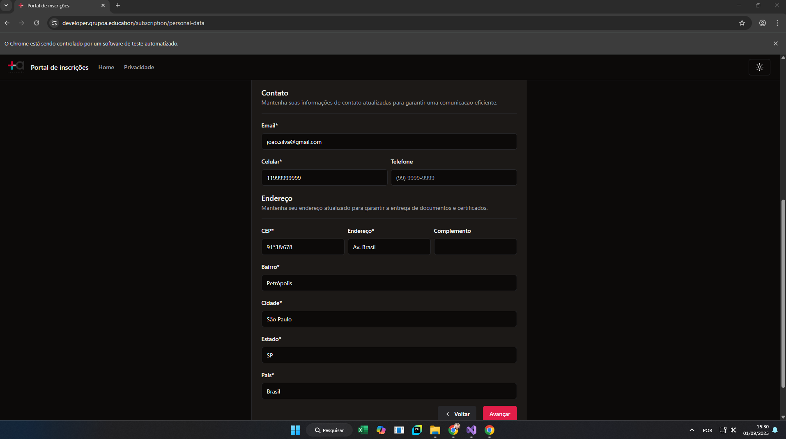

## Bug: Lista de cursos de Graduação contém também cursos de Pós-graduação

**ID:** BUG-001  
**Módulo:** Página de inscrição (`/subscription`)  
**Cenário de teste:** Validação da lista de cursos de Graduação  

### Passos para reprodução
1. Acessar a página de inscrição.  
2. Selecionar o nível Graduação.  
3. Observar a lista de cursos exibida.  

### Resultado atual
A lista de cursos exibida para o nível "Graduação" contém cursos de Pós-graduação.  
Exemplos indevidos:  
- Mestrado em Ciência da Computação  
- Doutorado em Engenharia de Software  
- Especialização em Segurança da Informação  

Foram retornados 28 cursos, quando o esperado seriam apenas os 18 cursos de Graduação.  

### Resultado esperado
Ao selecionar o nível "Graduação", devem ser exibidos apenas os cursos de Graduação, conforme definido na regra de negócio.  

### Impacto
- Gera confusão no processo de inscrição.  
- Possibilidade de inscrição incorreta em cursos de Pós-graduação.  
- Inconsistência na experiência do usuário e nas regras de negócio estabelecidas.  

### Evidência
O teste automatizado `ValidacaoDaListaDeCursosDeGraduacao` falhou ao comparar a lista obtida na interface com a lista definida nos requisitos.  

____________________________________________________________________________________________________________________

## Bug: Recuperação de usuário sem informar credenciais não exibe mensagem de erro

ID: BUG-002
Módulo: Página de autenticação (/subscription/authentication/recover-username)
Cenário de teste: Recuperação de usuário sem informar credenciais

### Passos para reprodução

1. Acessar a página de autenticação.
2. Não preencher o campo Usuário.
3. Clicar em "Recuperar usuário".

### Resultado atual

O sistema redireciona diretamente para a tela de confirmação exibindo “Usuário recuperado / Verifique seu email!”.
Nenhuma mensagem de erro é exibida solicitando o preenchimento do campo Usuário.
Nos testes automatizados, ocorre a exceção:

OpenQA.Selenium.NoSuchElementException : no such element: 
Unable to locate element: {"method":"css selector","selector":"#radix-59-form-item-message"}

### Resultado esperado

Ao tentar recuperar usuário sem preencher o campo:
Deve ser exibida uma mensagem de erro clara solicitando o preenchimento do campo Usuário (ex.: “Informe seu usuário para prosseguir com a recuperação”).
O sistema não deve redirecionar para a tela de confirmação sem essa validação.

### Impacto

Fluxo inconsistente: o usuário é instruído a verificar o email mesmo sem ter informado nenhum usuário.
Gera confusão no processo de autenticação.
Pode comprometer a confiança do usuário e a integridade do fluxo de login/recuperação.

### Evidência

O teste automatizado `RecuperacaoDeUsuarioSemInformarCredenciais` falhou ao não encontrar a mensagem de erro esperada.
Stacktrace principal:

____________________________________________________________________________________________________________________

## Bug: Redefinição de senha sem informar usuário exibe confirmação incorreta

**ID:** BUG-003  
**Módulo:** Página de autenticação (`/subscription/authentication/recover-password`)  
**Cenário de teste:** Redefinição de senha sem informar credenciais  

### Passos para reprodução
1. Acessar a página de autenticação.  
2. Não informar usuário/credenciais.  
3. Clicar em "Redefinir senha".  

### Resultado atual
O sistema exibe a tela de confirmação:  
**“Senha redefinida / Verifique seu email!”**  

Mesmo sem saber **quem é o usuário**, a aplicação informa que a senha foi redefinida e que um email foi enviado.  

### Resultado esperado
- O sistema deve **validar se existe um usuário associado** antes de permitir a redefinição de senha.  
- Caso o usuário não esteja informado, deve ser exibida uma mensagem de erro clara (ex.: *“Informe seu usuário para prosseguir com a redefinição de senha”*).  
- O sistema **não deve exibir confirmação de redefinição** sem essa validação.  

### Impacto
- **Falha grave de segurança e consistência:** o sistema confirma uma redefinição de senha sem saber a quem pertence.  
- **Risco de confusão do usuário:** ele recebe instruções de verificação de email sem ter fornecido identificação.  
- **Quebra do fluxo de autenticação:** invalida a lógica de que a redefinição só é possível para usuários válidos.  

### Evidência
- O teste automatizado `RedefinicaoDeSenhaSemInformarCredenciais` falhou, pois esperava uma mensagem de erro e encontrou uma tela de sucesso.  

____________________________________________________________________________________________________________________

## Bug: Acesso direto à área do candidato não redireciona para a tela de login

**ID:** BUG-004  
**Módulo:** Segurança / Área do candidato (`/subscription/candidate`)  
**Cenário de teste:** Tentativa de acesso direto sem login  

### Passos para reprodução
1. Acessar diretamente a URL `https://developer.grupoa.education/subscription/candidate` sem estar autenticado.  

### Resultado atual
O sistema retorna **erro 404 - Not Found**.  
Nos testes automatizados, ocorre a falha:

Não foi redirecionado para a URL da tela de login.
Expected: String containing "/subscription/authentication/login"
But was: "https://developer.grupoa.education/subscription/candidate"

### Resultado esperado
Ao tentar acessar a área do candidato sem estar autenticado:  
- O sistema deve redirecionar para a tela de login (`/subscription/authentication/login`), exibindo o formulário de autenticação.  
- O usuário não deve ter acesso direto ou receber erro 404.  

### Impacto
- **Inconsistência na experiência do usuário**: em vez de ver a tela de login, recebe uma página de erro.  
- **Possível falha de segurança**: a ausência de redirecionamento pode indicar que a proteção de rota não está corretamente configurada.  
- Dificulta a navegação e pode gerar confusão sobre o fluxo correto de autenticação.  

### Evidência
- Teste automatizado `TentativaDeAcessoDiretoSemLogin` falhou validando o redirecionamento esperado.  

____________________________________________________________________________________________________________________

## Bug: Cadastro aceita data de nascimento futura

**ID:** BUG-005  
**Módulo:** Página de inscrição (`/subscription`)  
**Cenário de teste:** Cadastro com campo Data inválido (futuro)  

### Passos para reprodução
1. Acessar a página de inscrição.  
2. Selecionar o nível (ex.: "Pós-graduação").  
3. Selecionar o curso (ex.: "Mestrado em Engenharia de Software").    
4. Preencher o formulário de cadastro com uma data de nascimento futura (ex.: 31/12/3000).  
5. Clicar em "Avançar" no cadastro.  

### Resultado atual
O sistema aceitou a data futura e não exibiu nenhuma mensagem de erro.  
O campo **Data de nascimento** foi submetido sem validação.  

### Resultado esperado
- O sistema deve validar se a data de nascimento não está no futuro.  
- Caso esteja, deve exibir mensagem de erro clara (ex.: *“Data de nascimento inválida”*).  
- O cadastro não deve prosseguir enquanto o campo não for corrigido.  

### Impacto
- **Falha de consistência nos dados cadastrais**: permite registro de informações impossíveis.  
- **Quebra de regra de negócio**: a data de nascimento deve sempre ser passada ou presente.  
- **Risco de dados inválidos no sistema**: compromete relatórios, análises e integridade do cadastro.  

### Evidência
- Teste automatizado `CadastroComCampoInvalidoTipo("Data","futuro")` falhou.  

____________________________________________________________________________________________________________________

## Bug: Cadastro aceita CEP inválido com letras

**ID:** BUG-006  
**Módulo:** Página de inscrição (`/subscription`)  
**Cenário de teste:** Cadastro com campo CEP inválido (letras)  

### Passos para reprodução
1. Acessar a página de inscrição.  
2. Selecionar o nível (ex.: "Pós-graduação").  
3. Selecionar o curso (ex.: "Mestrado em Engenharia de Software").  
4. Preencher o formulário de cadastro com um CEP inválido contendo letras (ex.: `12AB5678`).  
5. Clicar em "Avançar" no cadastro.  

### Resultado atual
- O sistema não exibiu mensagem de erro para o campo **CEP**.  
- O teste automatizado falhou por **timeout** tentando localizar o elemento de erro associado ao CEP.  
- Nenhuma validação foi aplicada, permitindo prosseguir com um CEP inválido.  

### Resultado esperado
- O sistema deve validar se o CEP contém apenas números e segue o formato esperado (8 dígitos).  
- Caso seja informado um CEP inválido, deve exibir mensagem de erro clara (ex.: *“CEP inválido. Informe apenas números”*).  
- O cadastro não deve prosseguir enquanto o campo não for corrigido.  

### Impacto
- **Dados inconsistentes**: cadastros podem armazenar CEPs inválidos.  
- **Risco de falhas posteriores**: integrações com serviços de endereço podem quebrar.  
- **Quebra da regra de negócio**: o CEP deve seguir padrão numérico válido.  

### Evidência
- Teste automatizado `CadastroComCampoInvalidoTipo("CEP","letras")` falhou.  

- 
____________________________________________________________________________________________________________________

## Bug: Cadastro aceita celular inválido com letras

**ID:** BUG-007  
**Módulo:** Página de inscrição (`/subscription`)  
**Cenário de teste:** Cadastro com campo Celular inválido (letras)  

### Passos para reprodução
1. Acessar a página de inscrição.  
2. Selecionar o nível (ex.: "Pós-graduação").  
3. Selecionar o curso (ex.: "Mestrado em Engenharia de Software").  
4. Preencher o formulário de cadastro com um celular inválido contendo letras (ex.: `11999abc999`).  
5. Clicar em "Avançar" no cadastro.  

### Resultado atual
- O sistema não exibiu mensagem de erro para o campo **Celular**.  
- O teste automatizado falhou por **timeout** tentando localizar o elemento de erro associado ao celular.  
- Nenhuma validação foi aplicada, permitindo prosseguir com um celular inválido.  

### Resultado esperado
- O sistema deve validar se o celular contém apenas números e segue o formato esperado.  
- Caso seja informado um celular inválido, deve exibir mensagem de erro clara (ex.: *“Celular inválido. Informe apenas números”*).  
- O cadastro não deve prosseguir enquanto o campo não for corrigido.  

### Impacto
- **Dados inconsistentes**: cadastros podem armazenar celulares inválidos.  
- **Problemas em contatos**: pode inviabilizar comunicações com o candidato.  
- **Quebra de regra de negócio**: o celular deve seguir padrão numérico válido.  

### Evidência
- Teste automatizado `CadastroComCampoInvalidoTipo("Celular","letras")` falhou.  

- 
____________________________________________________________________________________________________________________

## Bug: Cadastro aceita telefone inválido com letras

**ID:** BUG-008  
**Módulo:** Página de inscrição (`/subscription`)  
**Cenário de teste:** Cadastro com campo Telefone inválido (letras)  

### Passos para reprodução
1. Acessar a página de inscrição.  
2. Selecionar o nível (ex.: "Pós-graduação").  
3. Selecionar o curso (ex.: "Mestrado em Engenharia de Software").  
4. Preencher o formulário de cadastro com um telefone inválido contendo letras (ex.: `11999abc999`).  
5. Clicar em "Avançar" no cadastro.  

### Resultado atual
- O sistema não exibiu mensagem de erro para o campo **Telefone**.  
- O teste automatizado falhou por **timeout** tentando localizar o elemento de erro associado ao telefone.  
- Nenhuma validação foi aplicada, permitindo prosseguir com um telefone inválido.  

### Resultado esperado
- O sistema deve validar se o telefone contém apenas números e segue o formato esperado.  
- Caso seja informado um telefone inválido, deve exibir mensagem de erro clara (ex.: *“Telefone inválido. Informe apenas números”*).  
- O cadastro não deve prosseguir enquanto o campo não for corrigido.  

### Impacto
- **Dados inconsistentes**: cadastros podem armazenar telefones inválidos.  
- **Problemas em contatos**: pode inviabilizar comunicações com o candidato.  
- **Quebra de regra de negócio**: o telefone deve seguir padrão numérico válido.  

### Evidência
- Teste automatizado `CadastroComCampoInvalidoTipo("Telefone","letras")` falhou.  

____________________________________________________________________________________________________________________

## Bug: Cadastro aceita CEP inválido com caracteres especiais

**ID:** BUG-009  
**Módulo:** Página de inscrição (`/subscription`)  
**Cenário de teste:** Cadastro com campo CEP inválido (caracteres especiais)  

### Passos para reprodução
1. Acessar a página de inscrição.  
2. Selecionar o nível (ex.: "Pós-graduação").  
3. Selecionar o curso (ex.: "Mestrado em Engenharia de Software").  
4. Preencher o formulário de cadastro com um CEP inválido contendo caracteres especiais (ex.: `91*3&678`).  
5. Clicar em "Avançar" no cadastro.  

### Resultado atual
- O navegador encerrou a sessão durante a execução do teste.  
- O sistema não exibiu mensagem de erro para o campo **CEP**.  
- O teste automatizado falhou com **`invalid session id`**, indicando que não foi possível capturar a validação.  

### Resultado esperado
- O sistema deve validar se o CEP contém apenas números e segue o formato esperado (8 dígitos).  
- Caso seja informado um CEP inválido com caracteres especiais, deve exibir mensagem de erro clara (ex.: *“CEP inválido. Informe apenas números”*).  
- O cadastro não deve prosseguir enquanto o campo não for corrigido.  

### Impacto
- **Dados inconsistentes**: cadastros podem armazenar CEPs inválidos.  
- **Risco de falhas posteriores** em integrações com serviços de endereço.  
- **Possível instabilidade de teste**: a ausência de validação pode ter contribuído para falhas inesperadas na sessão.  

### Evidência
- Teste automatizado `CadastroComCampoInvalidoTipo("CEP","caracteres")` falhou.  

